# Курсовой проект MLOps

## Данилаева Софья

Курсовой проект по минимальному жизненному циклу ML-модели с использованием ClearML.

Проект реализует классификацию тональности текста:

- подготовка и версионирование датасета в ClearML Dataset
- удалённое обучение через ClearML Agent
- логирование гиперпараметров, метрик и артефактов
- публикация модели в ClearML Model Registry
- запуск HTTP inference endpoint
- пользовательский интерфейс на Gradio

## Структура проекта

```text
.
├── docker/                          # Docker Compose для ClearML Server
│   ├── docker-compose.yaml
│   └── clearml_config/
│       └── apiserver.conf           # Конфиг пользователей
├── src/                             # Исходный код
│   ├── prepare_data.py              # Скачивание и подготовка датасета
│   ├── create_clearml_dataset.py    # Загрузка датасета в ClearML
│   ├── train.py                     # Скрипт обучения модели
│   ├── serving.py                   # FastAPI inference endpoint
│   └── ui.py                        # Gradio интерфейс
├── data/                            # Данные
├── requirements.txt                 # Python-зависимости
└── clearml.conf.template            # Шаблон конфига ClearML
```

Для запуска нужно создать окружение и установить зависимости:

```bash
python3.11 -m venv .venv
source .venv/bin/activate
pip install --upgrade pip
pip install -r requirements.txt
```

## Подготовка инфраструктуры ClearML

### Запуск ClearML Server

```bash
cd docker
docker compose up -d
```

Проверка работы сервера:

```bash
curl http://127.0.0.1:9092/debug.ping
```

Ожидаемый ответ:

```json
{"data":{"msg":"ClearML server"}}
```

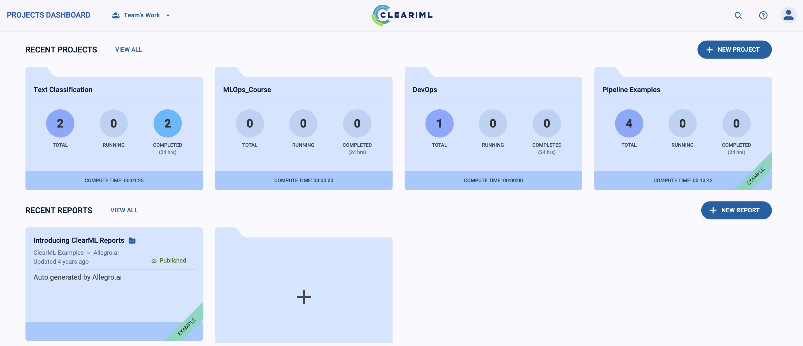

### Настройка ClearML SDK

1. Откройте веб-интерфейс: http://localhost:9091
2. Войдите под пользователем:
   - **Login**: `student`
   - **Password**: `password123`
3. Перейдите в **Settings → Workspace → Create new credentials**
4. Скопируйте сгенерированные `access_key` и `secret_key`
5. Создайте файл `~/clearml.conf` (или `./clearml.conf`) по шаблону `clearml.conf.template`:

```conf
api {
    web_server: http://localhost:9091
    api_server: http://localhost:9092
    files_server: http://localhost:9093
    credentials {
        "access_key" = "YOUR_ACCESS_KEY"
        "secret_key" = "YOUR_SECRET_KEY"
    }
}
```

Инициализация SDK:

```bash
clearml-init
```

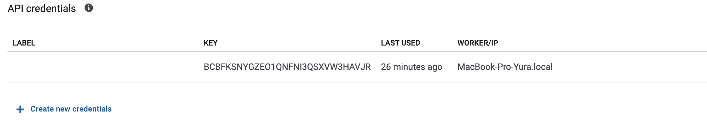

### Запуск ClearML Agent

Проект использует очередь `students`.

Создание очереди:

```bash
python -c "
from clearml.backend_api.session.client import APIClient
client = APIClient()
client.queues.create('students')
"
```

Запуск агента:

```bash
nohup clearml-agent daemon --queue students > agent.log 2>&1 &
```

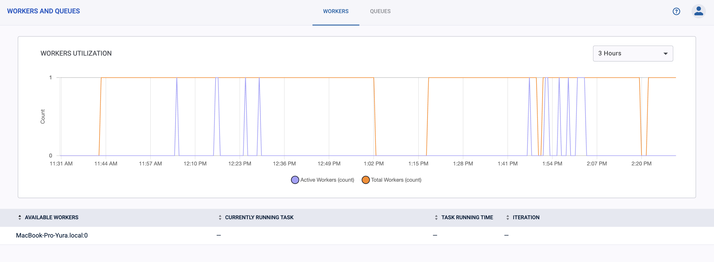

## Этап 1. Dataset в ClearML

Скрипт `src/prepare_data.py`:

- скачивает и подготавливает датасет для классификации тональности
- сохраняет данные в директорию `data/`

Скрипт `src/create_clearml_dataset.py`:

- создаёт ClearML Dataset
- добавляет файлы датасета
- фиксирует версию через `finalize(auto_upload=True)`

Запуск:

```bash
python src/prepare_data.py
python src/create_clearml_dataset.py
```

После выполнения скрипт выводит `Dataset ID`.

Этот ID используется при запуске обучения:

```python
dataset_id = "fc13ab60ae05404da075c528ed8eb79d"
```

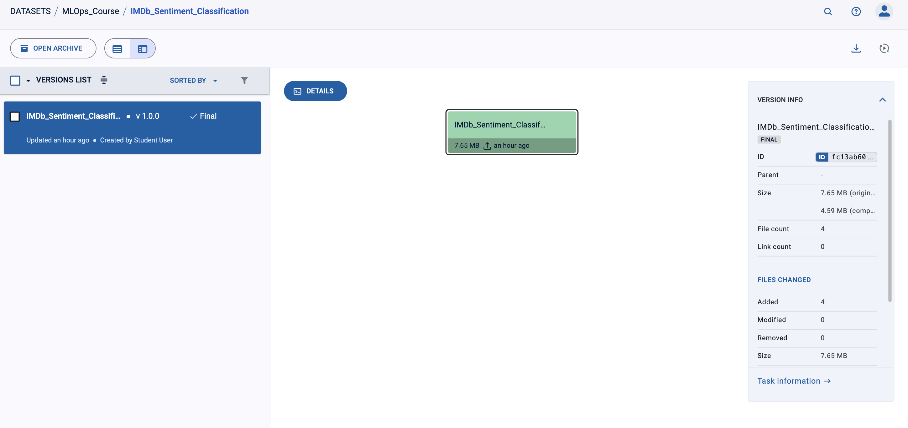

## Этап 2. Обучение через ClearML Agent

Скрипт `src/train.py`:

- создаёт ClearML Task в проекте `Text Classification`
- отправляет задачу в очередь `students`
- получает датасет из ClearML по `dataset_id`
- обучает модель `LogisticRegression`
- логирует гиперпараметры
- логирует метрики `accuracy` и `f1`
- сохраняет модель как artifact

Запуск экспериментов через `clearml-task` (обучение выполняется агентом, а не локально):

**Эксперимент 1:**

```bash
clearml-task --project "Text Classification" \
  --name "Exp1" \
  --script src/train.py \
  --queue students \
  --requirements requirements.txt \
  --args dataset_id=fc13ab60ae05404da075c528ed8eb79d max_features=1000 C=1.0
```

**Эксперимент 2:**

```bash
clearml-task --project "Text Classification" \
  --name "Exp2" \
  --script src/train.py \
  --queue students \
  --requirements requirements.txt \
  --args dataset_id=fc13ab60ae05404da075c528ed8eb79d max_features=5000 C=0.1
```

Параметры экспериментов:

|                  | Experiment 1 | Experiment 2 |
| ---------------- | ------------ | ------------ |
| `C`            | 1.0          | 0.1          |
| `max_features` | 1000         | 5000         |


| Experiment 1                   | Experiment 2                   |
| ------------------------------ | ------------------------------ |
| 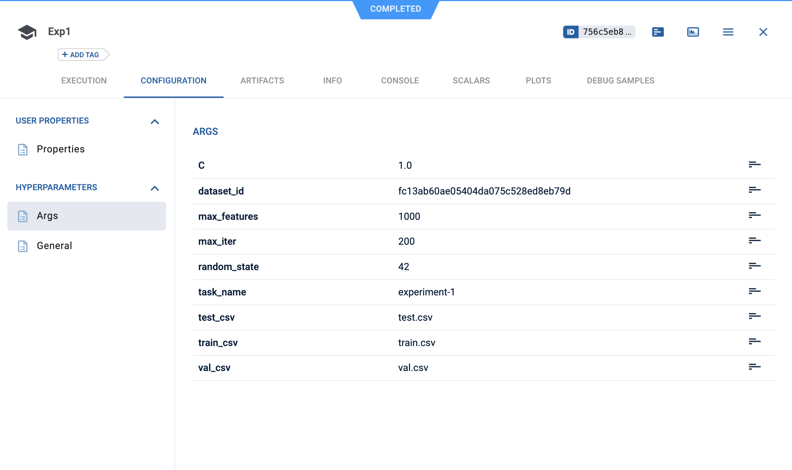  | 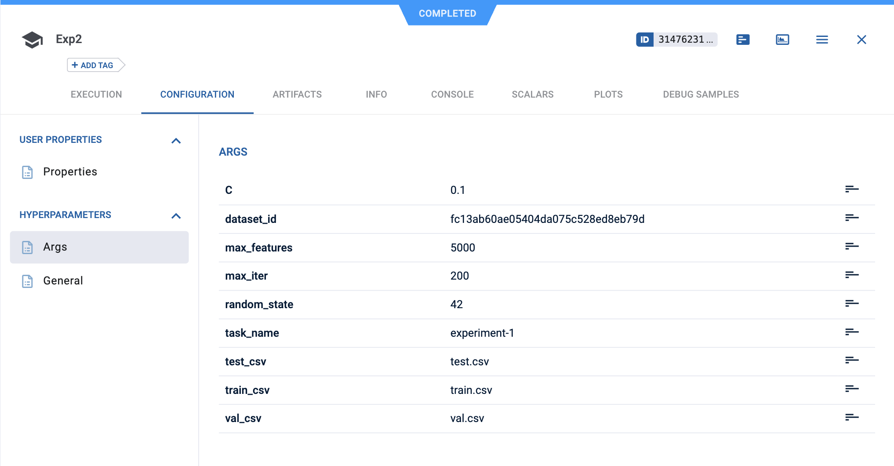  |
| 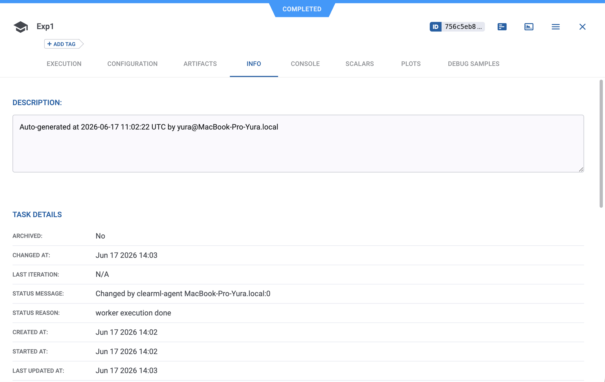  | 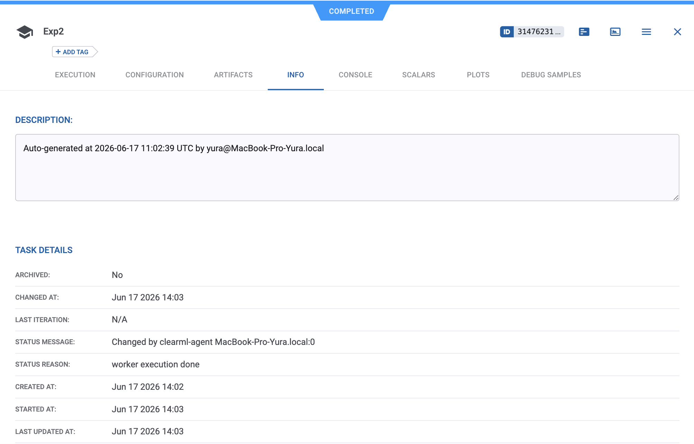  |
| 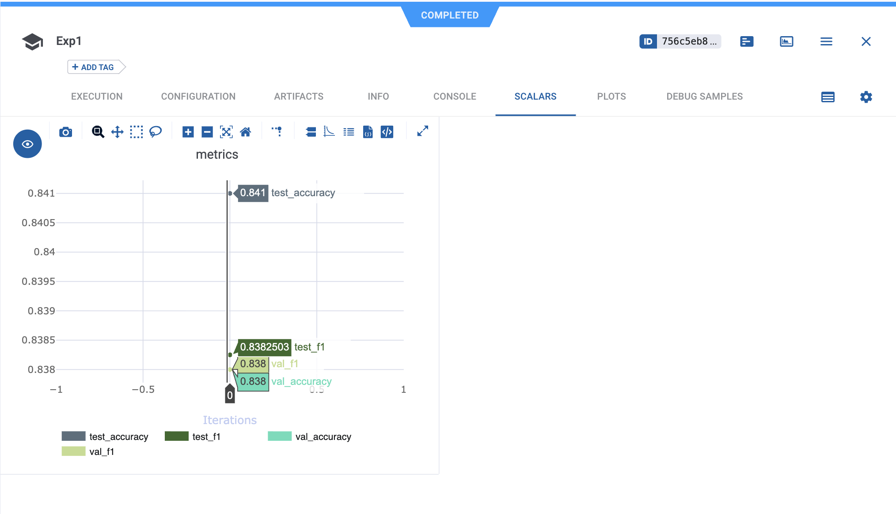  | 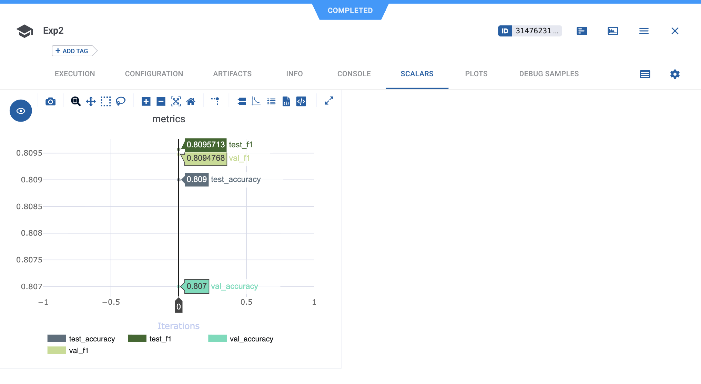 |
| 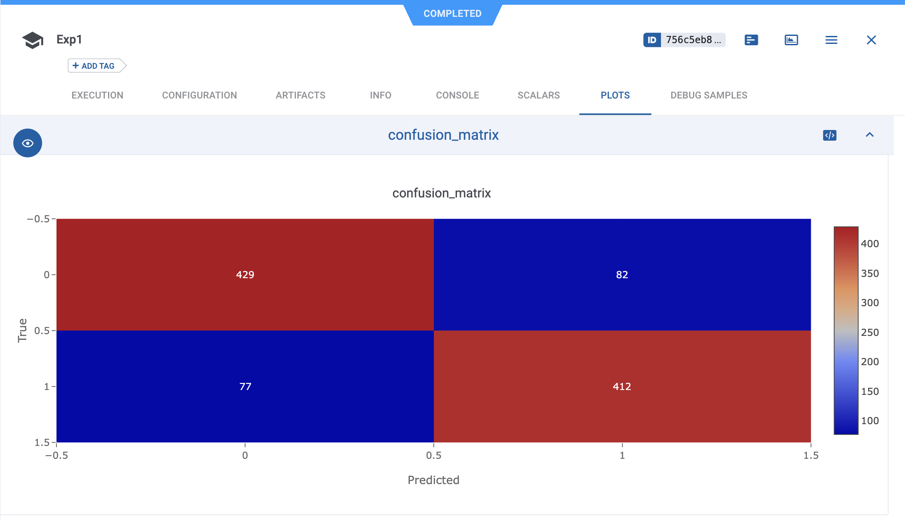 | 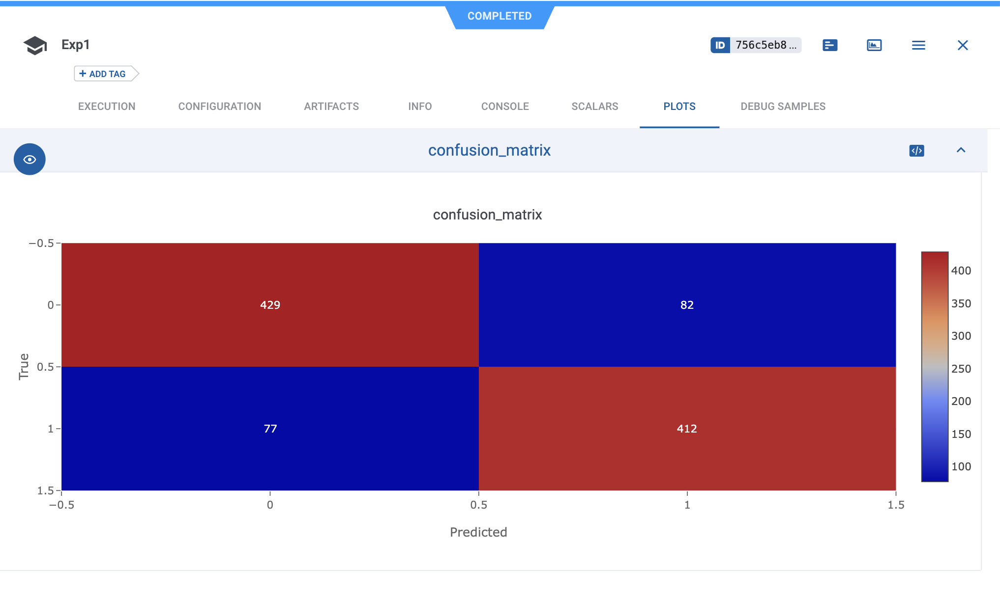 |

## Этап 3. Model Registry

После выбора лучшего эксперимента модель публикуется в ClearML Model Registry.

Публикация модели:

```bash
python -c "
from clearml import Model
model = Model(model_id='258f45e2527a4eb38eb4b329af147819')
model.publish()
print('Model published')
"
```

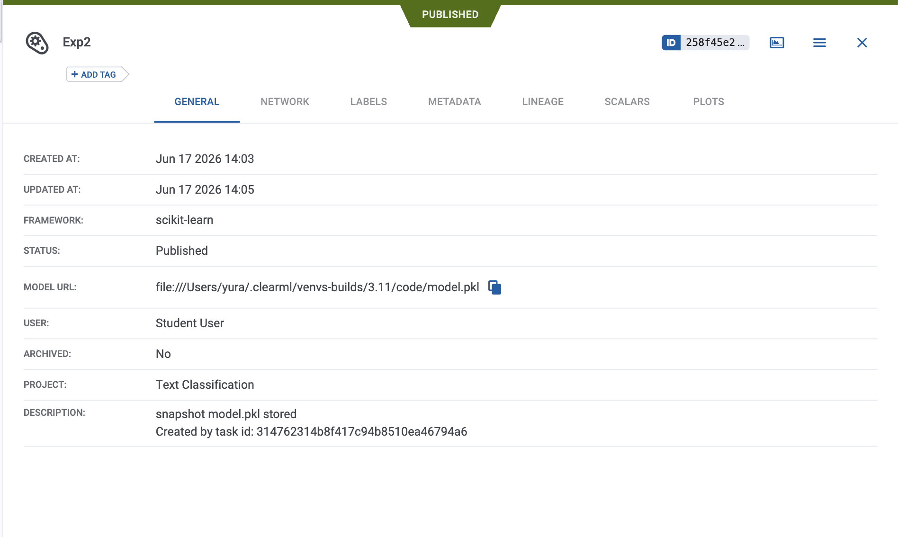

## Этап 4. Inference Endpoint

В проекте inference endpoint реализован через FastAPI.

Скрипт `src/serving.py`:

- загружает модель из ClearML по `model_id`
- поднимает HTTP endpoint
- принимает текст
- возвращает predicted label, confidence и latency

Запуск endpoint:

```bash
uvicorn serving:app --host 127.0.0.1 --port 8020
```

> Запускать из src проекта с активированным venv, либо указать модуль: `uvicorn src.serving:app --host 127.0.0.1 --port 8020`

Проверка через Swagger UI: http://127.0.0.1:8020/docs

Пример запроса для positive class:

```json
{
  "text": "film was amazing"
}
```

Ожидаемый ответ:

```json
{
  "label": "1",
  "confidence": 0.596,
  "latency_ms": 1.16
}
```

Пример запроса для negative class:

```json
{
  "text": "film was soo bad"
}
```

Ожидаемый ответ:

```json
{
  "label": "0",
  "confidence": 0.746,
  "latency_ms": 1.05
}
```

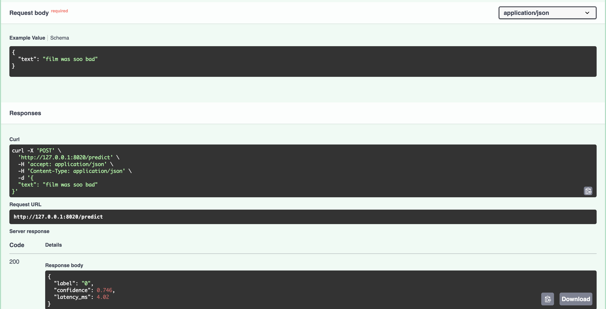

## Этап 5. Gradio UI

UI реализован в `src/ui.py`.

Он:

- содержит поле ввода текста
- содержит кнопку отправки запроса
- отправляет HTTP-запрос на endpoint
- возвращает тип
- показывает ошибку, если endpoint недоступен

Перед запуском UI должен быть запущен inference endpoint:

```bash
uvicorn serving:app --host 127.0.0.1 --port 8020
```

Запуск Gradio:

```bash
python src/ui.py
```

UI будет доступен по адресу, который выведет Gradio в консоли (обычно http://127.0.0.1:7860).

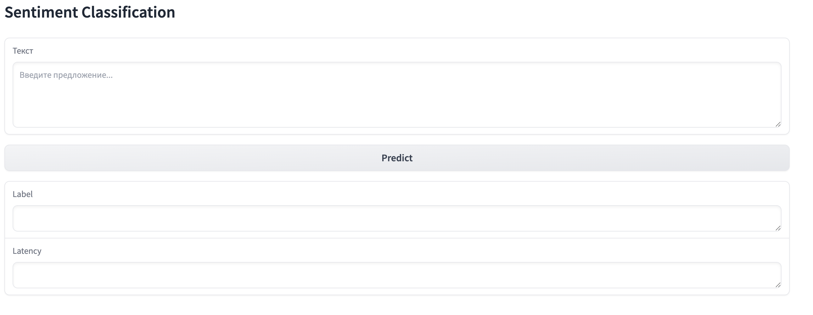

| negative                       | positive                       |
| ------------------------------ | ------------------------------ |
| 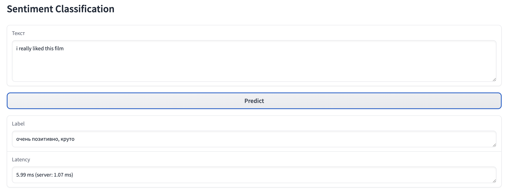 | 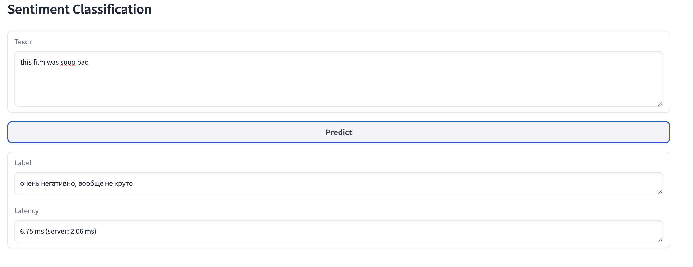 |
